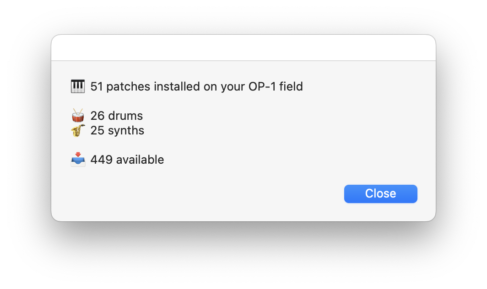

# OP-1 field counter

The OP-1 field can store up to 500 patches simultaneously. However, it doesn’t provide a way to know how many patches are in use or alert you when this limit is reached.

This script for Automator counts the number of patches installed and tracks the remaining available slots.

## Requirements
* An OP-1 field
* A Mac
* [TE field kit](https://teenage.engineering/guides/fieldkit) installed

## Installation
1. Open Automator and create a new `Application` workflow
2. Add a `Run AppleScript` action to the workflow, then paste the code from [this script](op-1-field-counter.applescript?raw=true) into the action
3. Save it in your `Applications` folder as `OP-1 field counter`
4. Swap the generic Automator icon with [this one](op-1-field-counter.icns?raw=true)

## Usage
1. Check that TE field kit is running on your Mac
2. Check that your OP-1 field is plugged via USB
3. Check that your OP-1 field is on MTP mode (`shift + com`, then `T4`)
4. Run `OP-1 field counter` from your `Applications` folder, or add it to your Dock for quick access

## Contributing
I’m not an expert, so this script may have bugs or miss important use cases. For example, it doesn’t work with the OG OP-1.

Contributions are welcome! If you’d like to improve the script, please open a pull request.
